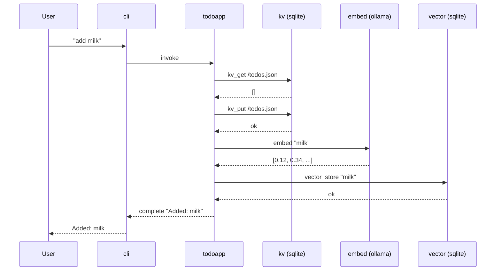

# Time Travel Demo — Advanced

The full time-travel workflow: repair a broken turn **and** recover
good work that happened after the failure.

See `docs/time-travel-demo.md` for the simple version (3 items, no cherry-pick).

## Prerequisites

Same as the simple demo:

```bash
git clone https://github.com/anthropics/vlindercli.git
cd vlindercli
just build

ollama pull nomic-embed-text
export VLINDER_OPENROUTER_API_KEY=<your-key>
just build-todoapp
```

```bash
VLINDER=./target/debug/vlinder
```

---

## What happens when you "add milk"

The todoapp is a state machine. Each service call is a separate
round-trip with the platform — and each one becomes a git commit.



Ten commits. One user interaction. Every arrow is recorded.

---

## The plan

```
  main:  milk ── bread ── ERROR ── butter ── coffee
                    │
                    │  checkout here, then repair
                    │
  repair:           └── eggs ── butter' ── coffee'
                                              │
                                              └── promoted to main
```

Items 1, 2, 4, 5 succeed. Item 3 fails because Ollama is down.
We go back, fix item 3, cherry-pick the good work (items 4 and 5)
from the broken timeline, and promote.

---

## Step 1: Add two items

```bash
$VLINDER agent run -p agents/todoapp
```

```
> add milk
Added: milk

> add bread
Added: bread
```

---

## Step 2: Kill Ollama, trigger an error

Open `http://localhost:11434` in a browser — "Ollama is running".

```bash
brew services stop ollama
```

Refresh — connection refused.

```
> add eggs
Error: embedding failed — connection refused
```

---

## Step 3: Restart Ollama, finish the list

```bash
brew services start ollama
```

```
> add butter
Added: butter

> add coffee
Added: coffee

> exit
```

---

## Step 4: Inspect the timeline

```bash
$VLINDER timeline log --oneline --grep="^invoke:" --grep="^complete:"
```

```
a1b2c3d complete: todoapp → cli
c2d3e4f invoke: cli → todoapp
e5f4a3c complete: todoapp → cli
d4e5f6a invoke: cli → todoapp
7d8e9f0 complete: todoapp → cli    ← error
f6a7b8c invoke: cli → todoapp
b3c4d5e complete: todoapp → cli
9c0d1e2 invoke: cli → todoapp
f1a2b3c complete: todoapp → cli
3e4f5a6 invoke: cli → todoapp
```

Five invoke/complete pairs. The third complete is the failure.

Drill into it:

```bash
$VLINDER timeline log --oneline --grep="Submission: sub-003"
```

```
7d8e9f0 complete: todoapp → cli
8b9c0d1 response: embed.ollama → todoapp       ← embedding failed
2e3f4a5 request: todoapp → embed.ollama
a0b1c2d response: infer.openrouter → todoapp
d4e5f6a request: todoapp → infer.openrouter
f6a7b8c invoke: cli → todoapp
```

OpenRouter succeeded. Ollama failed.

---

## Step 5: Find the right commit

We need two SHAs: the last good complete (checkout target) and
the error complete (cherry-pick range start).

Find the last good complete — the one just before the error.
List completes in chronological order:

```bash
$VLINDER timeline log --oneline --reverse --grep="^complete:"
```

```
f1a2b3c complete: todoapp → cli        ← milk
b3c4d5e complete: todoapp → cli        ← bread (last good)
7d8e9f0 complete: todoapp → cli        ← eggs (error)
e5f4a3c complete: todoapp → cli        ← butter
a1b2c3d complete: todoapp → cli        ← coffee
```

Checkout target: `b3c4d5e` (bread — last complete before the error).
Error commit: `7d8e9f0` (eggs — cherry-pick range starts after this).

Verify by inspecting the commits:

```bash
$VLINDER timeline show b3c4d5e --format="%s%n%b"
```

```
complete: todoapp → cli

Session: ses-...
Submission: sub-002
State: <state-hash>
```

State is present — this is a successful complete.

```bash
$VLINDER timeline show 7d8e9f0 --format="%s%n%b"
```

No `State:` trailer — the error didn't produce valid state.

---

## Step 6: Travel back

```bash
$VLINDER timeline checkout b3c4d5e
```

```
Checked out: complete: todoapp → cli
  Session:    ses-...
  Submission: sub-002
  State:      <state-hash>
```

---

## Step 7: Repair — re-add the failed item

```bash
$VLINDER timeline repair -p agents/todoapp
```

```
> add eggs
Added: eggs

> exit
```

Eggs are now cleanly recorded on the `repair-2026-02-13` branch.

> **Curious?** The agent's state was restored from a `State:` trailer
> on the git commit. See `docs/adr/055-state-store-model.md`.

---

## Step 8: Cherry-pick the good work

Butter and coffee succeeded on the old `main`. Each turn is multiple
commits (invoke, requests, responses, complete). Cherry-pick the
entire range — everything after the error:

```bash
$VLINDER timeline cherry-pick 7d8e9f0..main
```

This replays every commit after the error complete onto the repair
branch — both the butter and coffee turns with all their service calls.

No conflicts — each message lives in its own timestamped directory.

> **Curious?** The accumulated tree model is why cherry-pick works
> without conflicts. See `src/domain/workers/git_dag.rs`.

---

## Step 9: Promote

```bash
$VLINDER timeline promote
```

```
Labeled old main as: broken-2026-02-13
Promoted repair-2026-02-13 → main
```

---

## Step 10: Verify

```bash
$VLINDER timeline log --oneline --reverse --grep="^complete:"
```

```
f1a2b3c complete: todoapp → cli        ← milk
b3c4d5e complete: todoapp → cli        ← bread
4e5f6a7 complete: todoapp → cli        ← eggs (repaired)
e5f4a3c complete: todoapp → cli        ← butter (cherry-picked)
a1b2c3d complete: todoapp → cli        ← coffee (cherry-picked)
```

Five items. No error. Clean history.

The broken timeline is still there:

```bash
$VLINDER timeline log --oneline --reverse --grep="^complete:" broken-2026-02-13
```

```
f1a2b3c complete: todoapp → cli        ← milk
b3c4d5e complete: todoapp → cli        ← bread
7d8e9f0 complete: todoapp → cli        ← eggs (ERROR)
e5f4a3c complete: todoapp → cli        ← butter
a1b2c3d complete: todoapp → cli        ← coffee
```

Both timelines share milk and bread. They diverge where Ollama went down.

---

## What happened

| Step | Command | What it does |
|------|---------|-------------|
| Checkout | `timeline checkout <sha>` | Move HEAD to a known-good point |
| Repair | `timeline repair -p <agent>` | Branch off, restore agent state, re-enter REPL |
| Cherry-pick | `timeline cherry-pick <sha>..main` | Grab good commits from the broken timeline |
| Promote | `timeline promote` | Make the repair branch `main`, label the old one `broken-*` |

No data was lost. Both timelines exist. You chose which one is canonical.

---

## How it works

Every agent interaction produces a git commit with trailers
(`Session`, `Submission`, `State`) and per-field files in a timestamped
directory. Fork is `git checkout -b`. Promote is `git branch -f main`.
The entire conversation history is a content-addressed Merkle DAG
that happens to be a git repo.

The engineering is the product. Start here:

- `docs/MOTIVATION.md` — why this exists
- `docs/adr/054-two-store-model.md` — conversation store + state store
- `docs/adr/055-state-store-model.md` — git-like versioned state
- `docs/adr/081-time-travel-ux.md` — checkout, repair, promote
- `src/domain/workers/git_dag.rs` — how commits are built
- `src/commands/timeline.rs` — the timeline commands you just used
