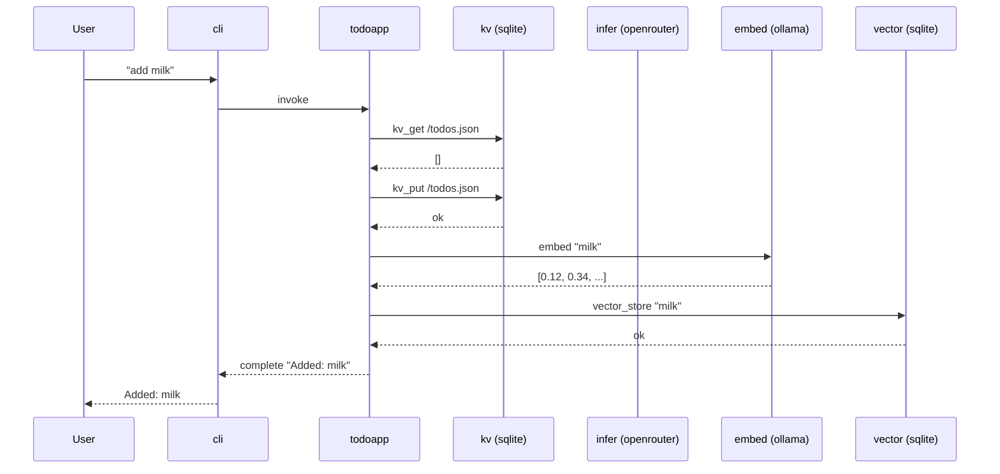

# Time Travel Demo

Debug and repair AI agents.

This walkthrough uses vlinder's todoapp agent to build a grocery list, simulates a service failure mid-conversation, then repairs the session.

Every step below uses real commands. Every side effect is recorded.
Nothing is hidden.

## Clone and build

```bash
git clone https://github.com/vlindercli/vlindercli.git
cd vlindercli
just build
```

For the rest of this demo:

```bash
VLINDER=./target/debug/vlinder
```

## What you need running

- **Ollama** with `nomic-embed-text` pulled (the todoapp uses it for semantic search)
- **`VLINDER_OPENROUTER_API_KEY`** set (the todoapp uses OpenRouter for inference)
- **Podman** (the agent runs in a container)

```bash
ollama pull nomic-embed-text
export VLINDER_OPENROUTER_API_KEY=<your-key>
just build-todoapp
```

---

## What happens when you "add milk"

The todoapp calls platform services via sidecar DNS hostnames. Each
service call is a separate round-trip — and each one is recorded
in the session's Merkle DAG.



---

## The plan

```
  main:  milk ── bread ── ERROR
                    │
                    │  fork here, then repair
                    │
  fix:              └── eggs
                          │
                          └── promoted to main
```

---

## Step 1: Deploy and add two items

```bash
$VLINDER agent deploy -p agents/todoapp
$VLINDER agent run todoapp
```

```
> add milk
Added: milk

> add bread
Added: bread
```

---

## Step 2: Kill Ollama

Open `http://localhost:11434` in a browser — you'll see "Ollama is running".

Now stop it:

```bash
brew services stop ollama
```

Refresh the browser — connection refused.

Back in the REPL:

```
> add eggs
Error: embedding failed — connection refused
```

The agent needs Ollama for embedding. With Ollama down, the
request fails. The error is recorded in the session.

```
> exit
```

---

## Step 3: Restart Ollama

```bash
brew services start ollama
```

Refresh the browser — "Ollama is running" again.

---

## Step 4: Inspect the session

```bash
$VLINDER session list todoapp
```

Find the session ID and inspect its history. Identify the last
successful turn — the one where bread was added.

---

## Step 5: Fork from the last good turn

```bash
$VLINDER session fork <session-id> --from <bread-state-hash> --name fix-eggs
```

This creates a new branch from the state after bread was added.
The error turn is on `main`, not on the fork.

---

## Step 6: Repair — re-add the failed item

```bash
$VLINDER agent run todoapp --branch fix-eggs
```

```
Resuming from state <bread-state-hash>…
> list
1. milk
2. bread

> add eggs
Added: eggs

> exit
```

Eggs are now cleanly recorded on the `fix-eggs` branch.

---

## Step 7: Promote

```bash
$VLINDER session promote fix-eggs
```

```
Old main sealed as broken-2026-03-11.
```

---

## Step 8: Verify

```bash
$VLINDER agent run todoapp
```

```
> list
1. milk
2. bread
3. eggs
```

Three items. No error. Clean history.

The broken session is still there — sealed, never deleted. Both
timelines coexist. You chose which one is canonical.

---

## What happened

| Step | Command | What it does |
|------|---------|-------------|
| Inspect | `session list` | See all sessions for an agent |
| Fork | `session fork --from --name` | Branch from a known-good state |
| Run on branch | `agent run --branch` | Resume agent from fork point |
| Promote | `session promote` | Make the fix branch canonical, seal the old one |

No data was lost. Both timelines exist. You chose which one is canonical.

---

## How it works

Every agent interaction is captured as a content-addressed snapshot in
a Merkle DAG. Fork creates a new branch from any completed turn.
Promote makes that branch canonical and seals the old one.

The engineering is the product. Start here:

- `docs/MOTIVATION.md` — why this exists
- `docs/VISION.md` — what VlinderCLI is and who it's for
