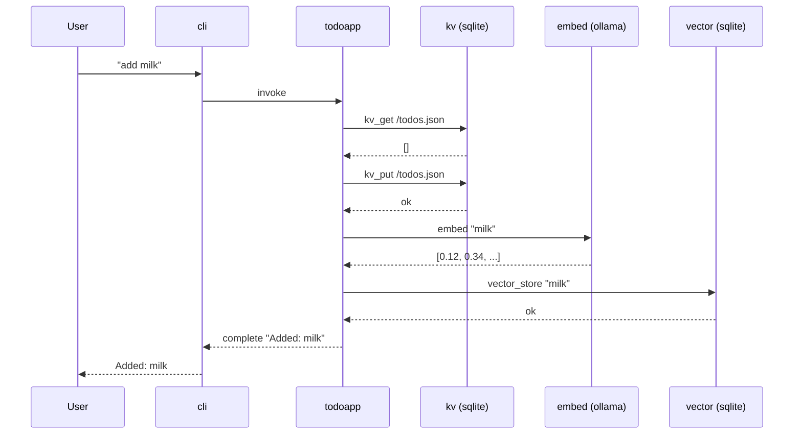

# Time Travel Demo

AI agents that can time travel.

This walkthrough uses vlinder's todoapp agent to build a grocery list, simulates a service failure mid-conversation, then repairs the timeline.

Every step below uses real commands. Every side effect is recorded.
Nothing is hidden.

## Clone and build

```bash
git clone https://github.com/anthropics/vlindercli.git
cd vlindercli
just build
```

For the rest of this demo:

```bash
VLINDER=./target/debug/vlinder
```

## What you need running

- **Ollama** with `nomic-embed-text` pulled (the todoapp uses it for semantic search)
- **`VLINDER_OPENROUTER_API_KEY`** set (the todoapp uses OpenRouter for inference)
- **Podman** (the agent runs in a container)

```bash
ollama pull nomic-embed-text
export VLINDER_OPENROUTER_API_KEY=<your-key>
just build-todoapp
```

---

## What happens when you "add milk"

The todoapp is a state machine. Each service call is a separate
round-trip with the platform — and each one becomes a git commit.



Ten commits. One user interaction. Every arrow is recorded.

---

## The plan

```
  main:  milk ── bread ── ERROR
                    │
                    │  checkout here, then repair
                    │
  repair:           └── eggs
                          │
                          └── promoted to main
```

---

## Step 1: Add two items

```bash
$VLINDER agent run -p agents/todoapp
```

```
> add milk
Added: milk

> add bread
Added: bread
```

Each turn produces several git commits in `~/.vlinder/conversations/` —
one per side effect (invoke, service request, response, complete).

---

## Step 2: Kill Ollama

Open `http://localhost:11434` in a browser — you'll see "Ollama is running".

Now stop it:

```bash
brew services stop ollama
```

Refresh the browser — connection refused.

Back in the REPL:

```
> add eggs
Error: embedding failed — connection refused
```

The agent needs Ollama for embedding. With Ollama down, the
request fails. The error is recorded in the timeline.

```
> exit
```

---

## Step 3: Restart Ollama

```bash
brew services start ollama
```

Refresh the browser — "Ollama is running" again.

---

## Step 4: Inspect the timeline

Every side effect is a commit. Filter by message type to see
the conversation as you experienced it — just the inputs and outputs:

```bash
$VLINDER timeline log --oneline --grep="^invoke:" --grep="^complete:"
```

```
7d8e9f0 complete: todoapp → cli    ← error recorded here
f6a7b8c invoke: cli → todoapp
b3c4d5e complete: todoapp → cli
9c0d1e2 invoke: cli → todoapp
f1a2b3c complete: todoapp → cli
3e4f5a6 invoke: cli → todoapp
```

Six commits — three invoke/complete pairs. The first complete is the
failed turn. Now drill into that specific invocation to see why:

```bash
$VLINDER timeline log --oneline --grep="Submission: sub-003"
```

```
7d8e9f0 complete: todoapp → cli
8b9c0d1 response: embed.ollama → todoapp       ← embedding failed
2e3f4a5 request: todoapp → embed.ollama
a0b1c2d response: infer.openrouter → todoapp
d4e5f6a request: todoapp → infer.openrouter
f6a7b8c invoke: cli → todoapp
```

There it is. The inference request to OpenRouter succeeded, but the
embedding request to Ollama failed. Every service call is a commit.

> **Curious?** The conversation repo is a real git repo. Go look:
> `ls ~/.vlinder/conversations/`
> Every message is a directory. Every field is a file. `git log` works.

---

## Step 5: Travel back

Note the bread complete SHA (`b3c4d5e`) — that's the last good point.

```bash
$VLINDER timeline checkout b3c4d5e
```

```
Checked out: complete: todoapp → cli
  Session:    ses-...
  Submission: sub-002
  State:      <state-hash>
```

HEAD is now at bread. The error is still on `main` but no longer here.

---

## Step 6: Repair the timeline

```bash
$VLINDER timeline repair -p agents/todoapp
```

Creates a `repair-2026-02-13` branch and drops into a REPL with
the agent's state restored to the bread commit.

```
> add eggs
Added: eggs

> exit
```

Eggs are now cleanly recorded. Ollama is back, embedding succeeds.

> **Curious?** The agent's state was restored from a `State:` trailer
> on the git commit. See `docs/adr/055-state-store-model.md`.

---

## Step 7: Promote

```bash
$VLINDER timeline promote
```

```
Labeled old main as: broken-2026-02-13
Promoted repair-2026-02-13 → main
```

---

## Step 8: Verify

```bash
$VLINDER timeline log --oneline --grep="^invoke:" --grep="^complete:"
```

```
4e5f6a7 complete: todoapp → cli
l7m8n9o invoke: cli → todoapp
b3c4d5e complete: todoapp → cli
9c0d1e2 invoke: cli → todoapp
f1a2b3c complete: todoapp → cli
3e4f5a6 invoke: cli → todoapp
```

Three invoke/complete pairs. No error. Clean history.

The broken timeline is still there:

```bash
$VLINDER timeline log --oneline --grep="^invoke:" --grep="^complete:" broken-2026-02-13
```

Both timelines share milk and bread. They diverge where Ollama went down.

---

## What happened

| Step | Command | What it does |
|------|---------|-------------|
| Checkout | `timeline checkout` | Move HEAD to a known-good point |
| Repair | `timeline repair` | Branch off, restore agent state, re-enter REPL |
| Promote | `timeline promote` | Make the repair branch `main`, label the old one `broken-*` |

No data was lost. Both timelines exist. You chose which one is canonical.

---

## How it works

Every agent interaction produces a git commit with trailers
(`Session`, `Submission`, `State`) and per-field files in a timestamped
directory. Fork is `git checkout -b`. Promote is `git branch -f main`.
The entire conversation history is a content-addressed Merkle DAG
that happens to be a git repo.

The engineering is the product. Start here:

- `docs/MOTIVATION.md` — why this exists
- `docs/adr/054-two-store-model.md` — conversation store + state store
- `docs/adr/055-state-store-model.md` — git-like versioned state
- `docs/adr/081-time-travel-ux.md` — checkout, repair, promote
- `src/domain/workers/git_dag.rs` — how commits are built
- `src/commands/timeline.rs` — the timeline commands you just used
